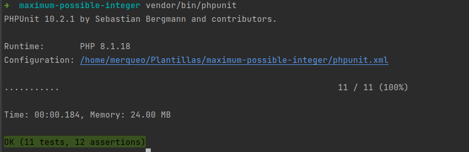
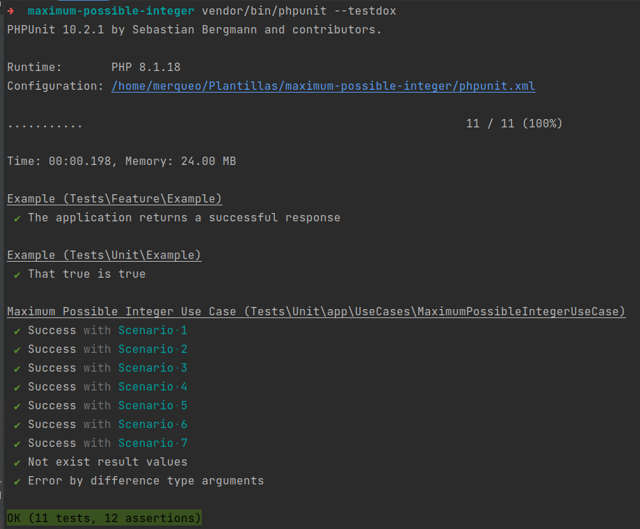
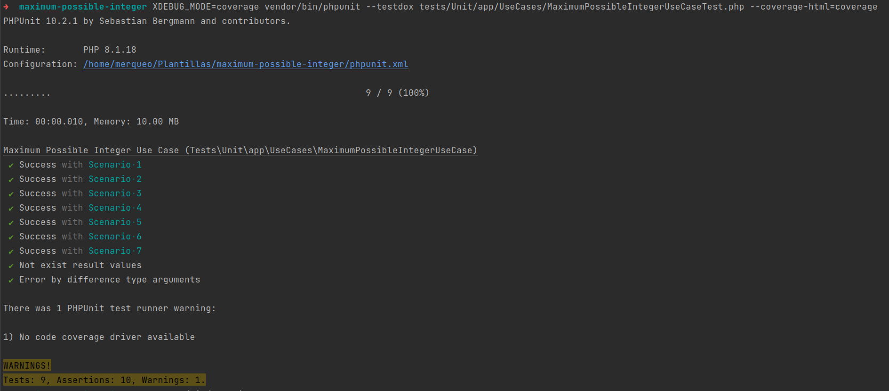

<p align="center"><a href="https://laravel.com" target="_blank"></a></p>

## Entero con valor máximo posible

Solución para el siguiente problema propuesto de encontrar el entero con el valor máximo posible:

- [Entero con valor máximo posbile](https://codeforces.com/problemset/problem/1374/A).

Para implementar la solución de este problema propuesto se utilizó el Framework Laravel 10.13.2. Con los siguientes requerimientos necesarios para ejecutar las pruebas:

- Php 8.1 o superior.
- Composer 2.5.4 o superior.
- Phpstan 1.10.
- Php-cs-fixer 3.14.

__NOTA.__ Para poder ejecutar las pruebas es necesario crear el archivo .env a partir de la copia de .env.example que se encuentra ubicado en la raiz del proyecto y luego ejecutar el siguiente comando:

```
php artisan key:generate
```

## Archivos creados para el problema propuesto

```text
app/UseCases/MaximumPossibleIntegerUseCase.php
```

```text
app/Exceptions/NumberValueCalculationException.php
```

```text
tests/Unit/app/UseCases/MaximumPossibleIntegerUseCaseTest.php
```

```text
tests/Unit/Scenarios/MaximumPossibleIntegerScenario.php
```

### Test unitarios

Se usa [PHPUnit](https://docs.phpunit.de/en/9.6/) para realizar los pruebas.

### Comando ejecutados.

- Ejecutar la pruebas en general.
```text
vendor/bin/phpunit
```
Resultado:



- Ejecutar la pruebas detallandolas.
```text
vendor/bin/phpunit --testdox
```

Resultado:



### Test unitarios con coverage

* Memoria utilizada: 10.00 MB / 256 MB.
* Tiempo de ejecución: 00:00:010 / 00:01:000.

Resultado:


Validación de la cobertura para el caso de uso creado obteniendo el 100%.
# maximum-possible-integer
